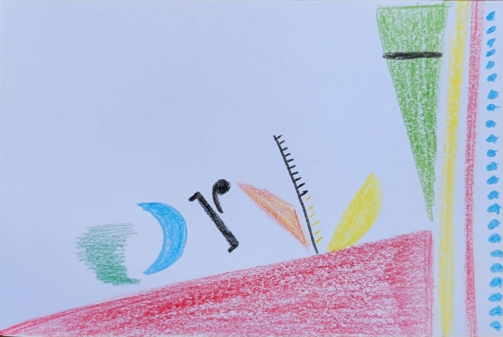

# Jonas Heim

I am a 2nd-year CAPP student originally from Switzerland. Thus, it comes to no surprize that I love the outdoors (especially skiing in the winter and hiking in the summer!) as well as chocolate and cheese (yes, loads of both). So I hope you don't mind if my visualizations have cheesy backgrounds.

Anyways, there's only so much I can tell you about myself in this raw-data format, so why don't you take a look at my data selfie below, which is essentially just a visualization of myself.

*To see what all of those symbols mean, check this [page](https://ideas.ted.com/how-to-draw-your-own-selfie-using-your-personal-data/) out!*
