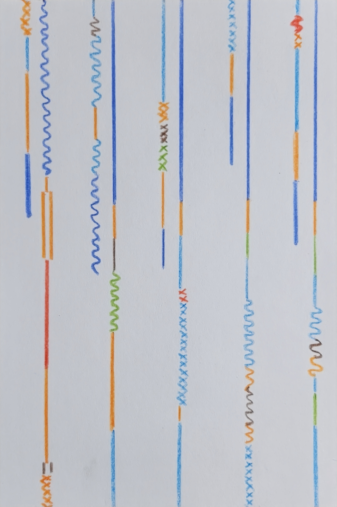
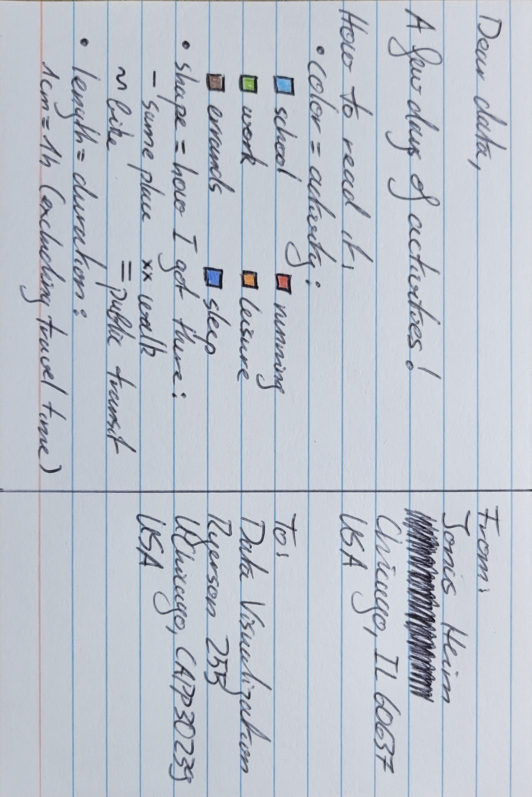

# Dear Data

This week, we recorded data on something in our everyday life and then made a visualization on it that would hold on a postcard.

I decided to record my timeline of activities and how I got to the place where I performed them. Anyways, enough talking, let's let the data speak for itself!

